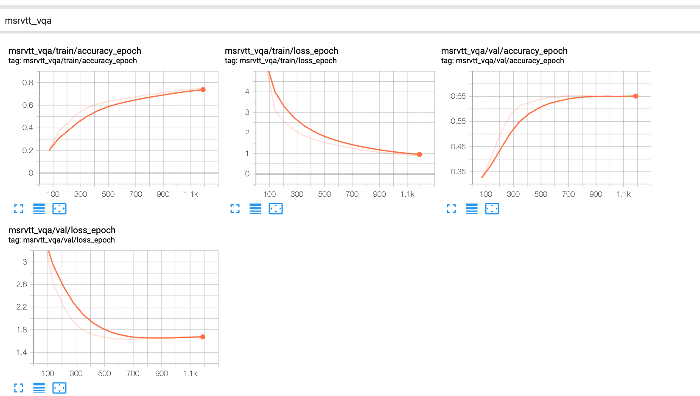
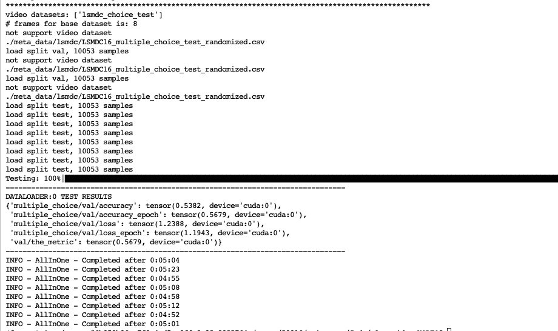

# Evaluation

We provide two types of logs: _tensor log_ or _txt file_.

## 1. VQA (_Fine-tuning_)

### Evaluate TGIF

#### TGIF-QA FrameQA

```bash
python run.py with data_root=DataSet num_gpus=8 \
num_nodes=1 \
num_frames=3 \
per_gpu_batchsize=8 task_finetune_tgifqa \
load_path="pretrained/all-in-one-base.ckpt"
```

|  Accuracy   | Report in Paper  | Trained Log |
|  ----  | ----  | --- |
| 65.0  | 64.0 | [Google Driver](https://drive.google.com/file/d/164UwQsl99zU1O81U014ihimLl5HNBSZT/view?usp=sharing) |

For tensor log, simple using 
```bash
mkdir tensor_log
cp [path_to_provided_logs] tensor_log/
tensorboard --logdir tensor_log
```
As below:




Notice msrvtt_vqa is a loss name which is equal to open-set VQA in the final code.

#### TGIF-QA Action/Transition

Modify line 19 in [`tgifqa`](AllInOne/datasets/tgifqa.py) for transition/action.

```bash
python run.py with data_root=DataSet num_gpus=8 \
num_nodes=1 \
num_frames=3 \
per_gpu_batchsize=16 task_finetune_tgif_action_trans \
load_path="pretrained/all-in-one-base.ckpt"
```

|  Accuracy   | Report in Paper  | Trained Log |
|  ----  | ----  | --- |
| 93.0  | 92.5 | [google driver](https://drive.google.com/file/d/1GQLvIKpEC_flfOFx9GA7c7Ks26cfcvcK/view?usp=sharing) |


### MSRVTT-QA

```bash
python run.py with data_root=DataSet num_gpus=8 \
num_nodes=1 \
num_frames=3 \
per_gpu_batchsize=16 task_finetune_msrvttqa \
load_path="pretrained/all-in-one-base.ckpt"
```

|  Accuracy   | Report in Paper  | Trained Log |
|  ----  | ----  | --- |
| 42.9  | 42.5 | [google driver](finetune_msrvtt_qa_seed0_from_last2022_2_25) |

### MSVD-QA
```bash
python run.py with data_root=DataSet num_gpus=8 \
num_nodes=1 \
num_frames=3 \
per_gpu_batchsize=16 task_finetune_msvdqa \
load_path="pretrained/all-in-one-base.ckpt"
```

|  Accuracy   | Report in Paper  | Trained Log |
|  ----  | ----  | --- |
| 46.1  | 46.5 | [google driver](https://drive.google.com/file/d/1f-vSnS1I7vu6Z7eiimGGY8B1vRbnNn0W/view?usp=sharing) |


## 2. Action Recognition (_Linear Evaluation_)

### K400
```bash
python run.py \
with data_root=DataSet num_gpus=8 num_nodes=1 \
per_gpu_batchsize=16 task_finetune_action_recognition_k400 \
num_frames=8 linear_evaluation=True \
load_path="pretrained/all-in-one-base.ckpt"
```

|Accuracy|Report in Paper| Trained Log |
| ---- |---- | --- |
| 52.3  | 50.8 | [Google Driver](https://drive.google.com/file/d/1ZGxod59se13dZwD7wSIGOAVywV3zXEA3/view?usp=sharing) |

### HMDB51
```bash
python run.py \
with data_root=DataSet num_gpus=8 num_nodes=1 \
per_gpu_batchsize=8 task_finetune_action_recognition_hmdb51 \
num_frames=3 linear_evaluation=True backend='a100' \
load_path="pretrained/all-in-one-base.ckpt"
```


|  Accuracy   | Report in Paper  | Trained Log |
|  ----  | ----  | --- |
| 51.2 | 50.8 | [Google Driver](https://drive.google.com/file/d/1PSnc6CHZS16JWnpNRdRbfeuFEejEBRP6/view?usp=sharing) |


## 3. Multiple-choice (_Zero-shot_)

Zero-shot task is directly test the pretrained models, we can get these performances in a few minutes.

### LSMDC

```bash
python run.py with data_root=DataSet num_gpus=8 num_nodes=1 \
per_gpu_batchsize=8 task_finetune_lsmdcchoice test_only=True \
num_frames=3 \
load_path="pretrained/all-in-one-base.ckpt"
```

|  Accuracy   | Report in Paper  | 
|  ----  | ----  | 
| 56.7 | 56.3 | 

Example:



### MSRVTT

```bash
python run.py with data_root=DataSet num_gpus=8 num_nodes=1 \
per_gpu_batchsize=8 task_finetune_msrvttchoice test_only=True \
num_frames=3 \
load_path="pretrained/all-in-one-base.ckpt"
```

|  Accuracy   | Report in Paper  | 
|  ----  | ----  | 
| 78.1 | 77.5 |


### Ego-4d
```bash
python run.py with data_root=DataSet num_gpus=8 num_nodes=1 \
per_gpu_batchsize=8 task_finetune_ego4dchoice test_only=True \
num_frames=3 \
load_path="pretrained/all-in-one-base.ckpt"
```

|  Accuracy   | Report in Paper  | 
|  ----  | ----  | 
| 36.5 | 36.5 |


## 4. Fast Retrieval

To speed up retrieval efficiency, we get ride of one-to-one matching in one-stream network.

The retrieval time cut down from 26H -> 1H on MSRVTT with our implementation, and only slightly drop in performance.

### MSRVTT
#### VTC only
```bash
python run.py with \
data_root=DataSet num_gpus=8 num_nodes=1 \
per_gpu_batchsize=32 task_finetune_only_ind_itc_msrvtt_randaug \
num_frames=3 \
load_path="pretrained/all-in-one-base.ckpt"
```

|  R1/R5/R10   | Report in Paper  | Trained Log |
|  ----  | ----  | --- |
| 35.6/62.8/71.3 | 36.1/62.3/72.1 | [Google Driver](https://drive.google.com/file/d/16JCLNSLcBidI5cEBrXL1gT6eeFaTHeuJ/view?usp=sharing) |

#### VTC + VTM
Since VTM need to sample N false texts, please use GPU memory as much as possible for best result.
The R@1 is not very stable, run multiple times for best solution.

```bash
python run.py with \
data_root=DataSet num_gpus=8 num_nodes=1 \
per_gpu_batchsize=6 task_finetune_ind_itc_irtr_msrvtt_randaug \
num_frames=3 \
load_path="pretrained/all-in-one-base.ckpt"
```

|  R1/R5/R10   | Report in Paper  | Trained Log |
|  ----  | ----  | --- |
| 35.4/67.0/77.6 | 37.1/66.7/75.9 | [Google Driver](https://drive.google.com/file/d/1zLqD6VHjw9Ht6K2Bz7941QMXPVUizwVJ/view?usp=sharing) |


#### VTC AllInOne+
By co-training with image dataset.

|  R1/R5/R10  | Trained Log |
|  ----  | --- |
| 41.8/68.5/76.7 | [Google Driver](https://drive.google.com/file/d/1IIDGULgtStmlSm9USOAOlf32jEnuBLXY/view?usp=sharing) |

