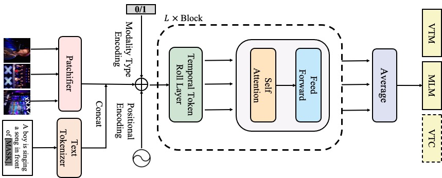

[](
https://paperswithcode.com/sota/visual-question-answering-on-msrvtt-qa-1?p=all-in-one-exploring-unified-video-language)

[](
https://paperswithcode.com/sota/visual-question-answering-on-msvd-qa-1?p=all-in-one-exploring-unified-video-language)

[](
https://paperswithcode.com/sota/tgif-frame-on-tgif-qa?p=all-in-one-exploring-unified-video-language)

[comment]: <> ([![PWC]&#40;https://img.shields.io/endpoint.svg?url=https://paperswithcode.com/badge/all-in-one-exploring-unified-video-language/video-retrieval-on-msr-vtt&#41;]&#40;)

[comment]: <> (https://paperswithcode.com/sota/video-retrieval-on-msr-vtt?p=all-in-one-exploring-unified-video-language&#41;)


# All-in-one

Code for the paper: All in One: Exploring Unified Video-Language Pre-training [Arxiv](https://arxiv.org/abs/2203.07303)
---



## Install

### 1.  PytorchLighting
In this work, we use PytorchLighting for distributed training with mixed precision.
Install pytorch and PytorchLighting first.

```bash
conda create -n allinone python=3.7
source activate allinone
cd [Path_To_This_Code]
pip install -r requirements.txt
```

If all packages include ffmpeg installed, please skip step 2.

### 2. On-the-fly decode (may skip)
To speed up the pre-training, we adopt on-the-fly decode for fast IO.
Install ffmpeg as below.

#### 1. ffmpeg
```bash
sudo conda install -y ffmpeg
```

Please install the required packages if not included in the requirements.txt.

If you server cannot connect to http or install ffmpeg slowly. Please download static binary file from [FFmpeg Static Builds](https://johnvansickle.com/ffmpeg/) and then add to path variable, as follows:

```bash
export PATH=[PATH_TO_Dir/]ffmpeg-git-20220108-amd64-static:$PATH
```

#### 2. pytorch video
Install pytorchvideo (for data augmentation) as below:

```bash
pip install ffmpeg-python
pip install pytorchvideo
```

## Download Pretrained Weights
We provide three pretrained weights in google driver.

|  Model   | Parameter | Pretrained Weight  | Trained Log | Hparams |
|  ----  |  ---- | ----  | ---- | ---- |
| All-in-one-Ti | 12M| [Google Driver](https://drive.google.com/file/d/1-mS9U1xRnvumaftjhxJsr_t4WjJ-gp7t/view?usp=sharing) | [Google Driver](https://drive.google.com/file/d/1j27-i7WsNDtj9k0CSnDC9sThMMjMRF-U/view?usp=sharing) | [Google Driver](https://drive.google.com/file/d/1DmZ5apWqIuUMRg7igdN2sHM2INrT_UZo/view?usp=sharing)|
| All-in-one-S |33M| [Google Driver](https://drive.google.com/file/d/1ntyEsFWLG8XQZ9oliYsrRZmhp_OMbQJ-/view?usp=sharing) | [Google Driver](https://drive.google.com/file/d/10uJZUMH10D1QD_o2g0WmXfv47xTAV5hJ/view?usp=sharing) |  [Google Driver](https://drive.google.com/file/d/12levE9kXQbWykJHUKqXNQZz32vtOPRLt/view?usp=sharing)|
| All-in-one-B |110M| [Google Driver](https://drive.google.com/file/d/1z3g891ND6CGCUkVzCXr2647wVG-15uUS/view?usp=sharing) | [Google Driver](https://drive.google.com/file/d/1FBs6HOeXr3Bo_UZLDq13qscLTMqITGWC/view?usp=sharing) | [Google Driver](https://drive.google.com/file/d/1D7OiF9HpIIsFk20LkCUWYThpXo_NPzT0/view?usp=sharing) |

After downloaded these pretrained weights, move them into pretrained dir.
```bash
mkdir pretrained
cp *.ckpt pretrained/
```

### Compare with state-of-the-arts

|Model|Param|Data|Frames|TGIF-Action|TGIF-Frame|MSR R@5|MSR R@10|
|---|---|---|---|---|---|---|---|
|ClipBERT|137M|Coco+VG|8 x 2|82.9|59.4|49.2|63.5|
|VIOLET|198M|Webvid+CC3|16|87.1|-|63.0|73.4|
|All-in-one-S|33M|WebVid+Howto|3|91.2|64.0|61.5|70.9|
|All-in-one-B|110M|WebVid+Howto|3|**92.9**|**64.2**|**67.0**|**77.1**|
|All-in-one-B+|110M|Webvid+CC3|3|**95.4**|**67.2**|**71.2**|**80.3**|
|All-in-one-B+|110M|Webvid+YTT+HowTo+CC3+CC12+Coco+VG|3||||


## Dataset Preparation
See [`DATA.md`](DATA.md)

## Pre-training
### Full Video Pre-training
See [`TRAIN.md`](TRAIN.md)
### Co-training with Image Dataset (All-in-one+)
See [`COTRAIN.md`](COTRAIN.md)

## Evaluation on Downstream Tasks
See [`EVAL.md`](EVAL.md)

By unified design and sparse sampling, AllInOne show much small flops.


## News
### 2022.3.14 The first version of AllInOne is released. 
### 2022.5.07 AllInOne+ is released. The main different between AllInOne is the Image and Video Co-train. The detail instructions and results on seven pre-training dataset are in progress.

## Citation
If you find our work helps, please cite our paper.

```bash
@article{wang2022allinone,
  title={All in One: Exploring Unified Video-Language Pre-training},
  author={Wang, Alex Jinpeng and Ge, Yixiao and Yan, Rui and Ge Yuying and Lin, Xudong and Cai, Guanyu  and Wu, Jianping and Shan, Ying and Qie, Xiaohu and Shou, Mike Zheng},
  journal={arXiv preprint arXiv:2203.07303},
  year={2022}
}
```

## Contact

Email: _awinyimgprocess at gmail dot com_

If you have any problem or have difficult in reproducing the results reported in this code, you can email to me or open a question in issues.
We are also willing to merge the code if transfer our All-in-one to different tasks or datasets.


## Acknowledgement
This work is mainly based on [ViLT](https://github.com/dandelin/ViLT), [Frozen](https://github.com/m-bain/frozen-in-time) and [Merlot](https://github.com/rowanz/merlot).

## License
MIT