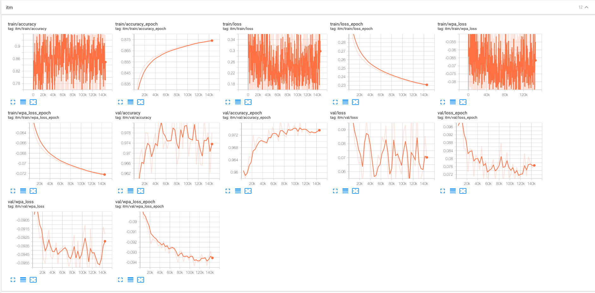

# Train New Models

## Download ViT/DeiT Pretrained Model

If the server cannot connect to https, please download pretrained (DeiT/ViT) weight in advance as follows.
```bash
cd pretrained
wget -c https://dl.fbaipublicfiles.com/deit/deit_tiny_patch16_224-a1311bcf.pth
wget -c https://dl.fbaipublicfiles.com/deit/deit_small_patch16_224-cd65a155.pth
wget -c https://github.com/rwightman/pytorch-image-models/releases/download/v0.1-vitjx/jx_vit_base_p16_224-80ecf9dd.pth

```

## Pretraining

### Webvid
```bash
python move_pretrained_weight.py

python run.py with data_root=DataSet \
num_gpus=8 num_nodes=4 \
num_frames=8 \
task_mlm_itm_webvid whole_word_masking=True \
step200k per_gpu_batchsize=16
```
### HowTo
```bash
python move_pretrained_weight.py

python run.py with data_root=DataSet \
num_gpus=8 num_nodes=4 \
num_frames=8 \
task_mlm_itm_howto whole_word_masking=True \
step200k per_gpu_batchsize=16
```

### Webvid+HowTo

```bash
python move_pretrained_weight.py

python run.py \
with data_root=DataSet num_gpus=8 num_nodes=4 \
num_frames=3 \
task_mlm_itm_webvid_howto whole_word_masking=True step200k per_gpu_batchsize=16
```

We release  a tensorboard train logs for reference here [tensorboard online](https://tensorboard.dev/experiment/0DCg4Ph9S5SmyMHpK6erOQ/#scalars).
The capture shown as below:




### Webvid+HowTo [All-in-one-tiny]

```bash
python move_pretrained_weight.py

python run.py with data_root=DataSet \
num_gpus=8 num_nodes=16 \
task_mlm_itm_webvid_howto whole_word_masking=True \
vit="vit_deit_tiny_patch16_224" image_size=224 patch_size=16 \
hidden_size=192 num_heads=3 num_layers=12
```

### Webvid+HowTo [All-in-one-small]

```bash
python move_pretrained_weight.py

python run.py with data_root=DataSet \
num_gpus=8 num_nodes=16 \
task_mlm_itm_webvid_howto whole_word_masking=True \
vit="vit_deit_small_distilled_patch16_224" image_size=224 patch_size=16 backend="a100" \
hidden_size=384 num_heads=6 num_layers=12
```

### Webvid+HowTo+YT-Temporal

```bash
python move_pretrained_weight.py

python run.py with data_root=DataSet \
num_gpus=8 num_nodes=16 \
task_mlm_itm_webvid_howto_ytt whole_word_masking=True \
step200k per_gpu_batchsize=16 num_frames=3
```